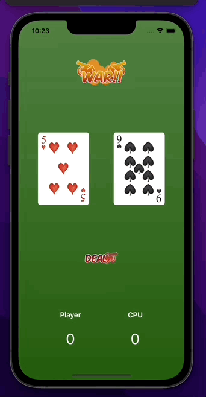

# SwiftUI
# Swift Programming 🏆

This repo will contain a wide range of different apps written with Swift with SwiftUI on purpose to make me a better programmer.  
The level of difficulty will increase with time.  
Apps here are part of this [course](https://codewithchris.com/) 👀. 
I try to learn things that I don't know and also add some extra features for each app.  
Take a look and ask my questions about it❕  

# SwiftUI foundations 👶

## CardWars - mini game with randomness!

  
Click to expand details!

  
  This app is a simple game where users can play card wars with a CPU> 
  Simply press a button to get a random card, if your card is bigger than the CPU you won.  
  The purpose of this project was to create a UI using only a SwiftUI.  
  Here are the results:  

  ### Layout1 app
    

  

 
